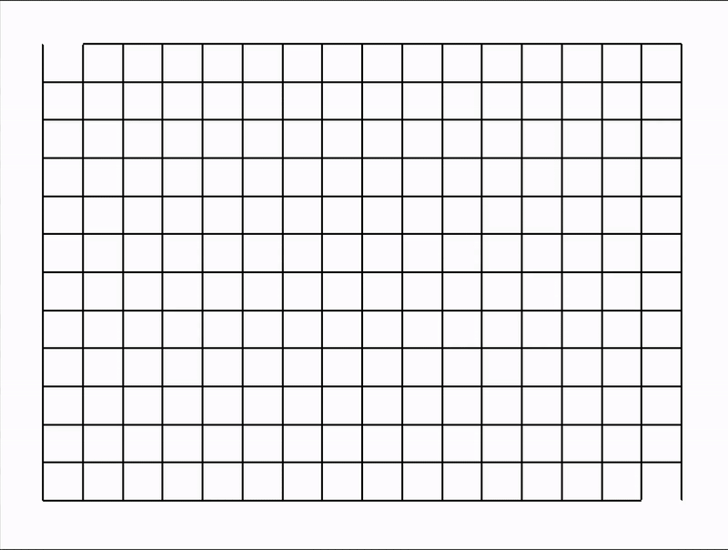

# 🧭 Maze Solver with Tkinter

This project is a **maze generator and solver** built with **Python** and **Tkinter** for real-time visualization.
It automatically generates a random maze and then solves it using a pathfinding algorithm, all visualized step-by-step in a graphical window.



## 🎮 Features

- ✅ Random maze generation
- ✅ Visual maze solving
- ✅ Adjustable grid size

## ▶️ How to Run

1. **Clone the repository**

   ```bash
   git clone https://github.com/AntoineMeunier52/maze-solver
   cd maze-solver
   python3 src/main.py
   ```
